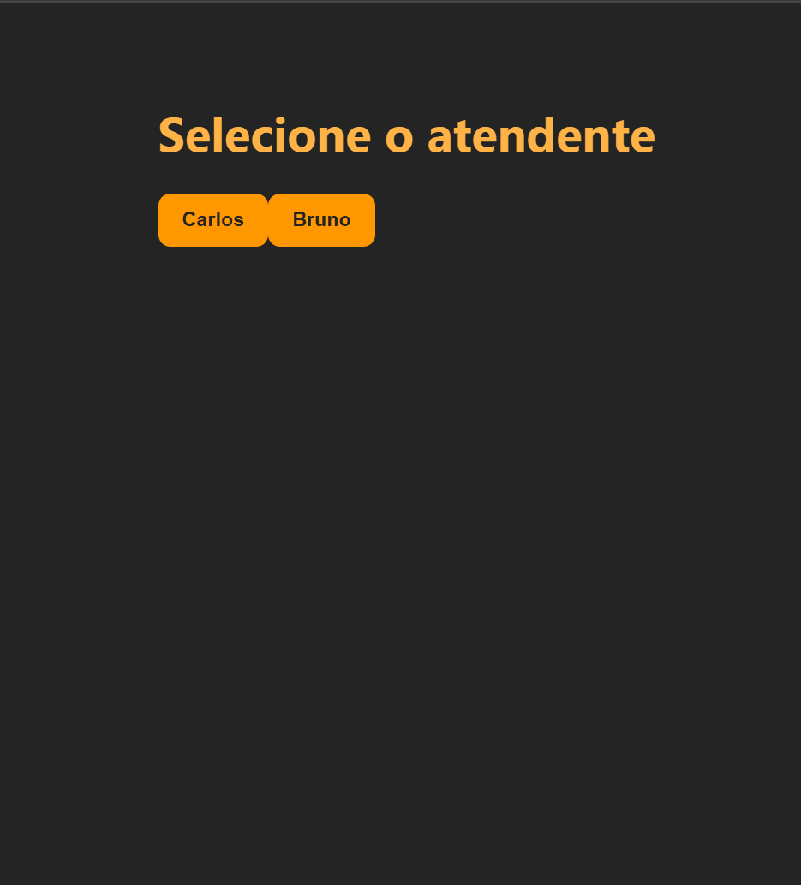
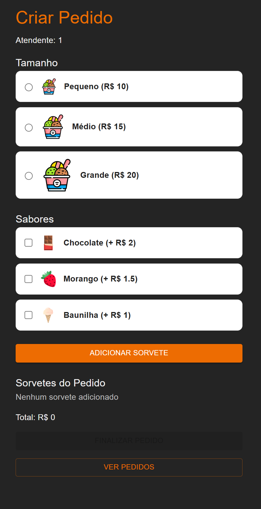
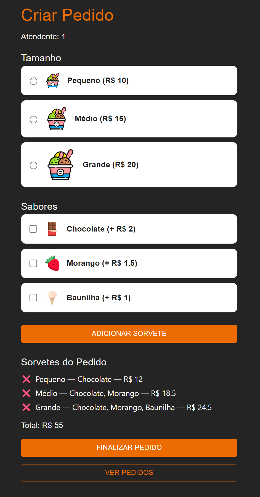
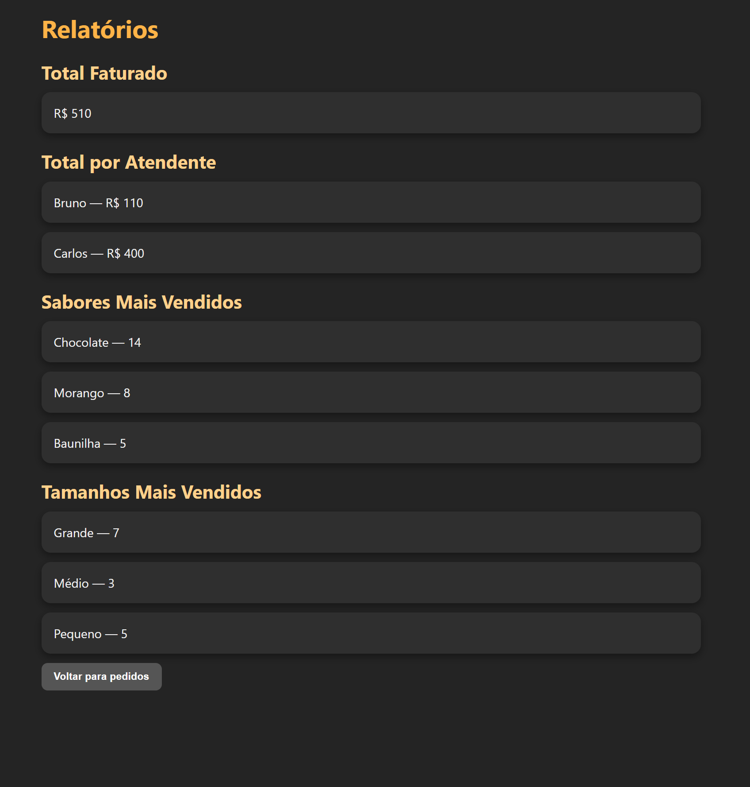
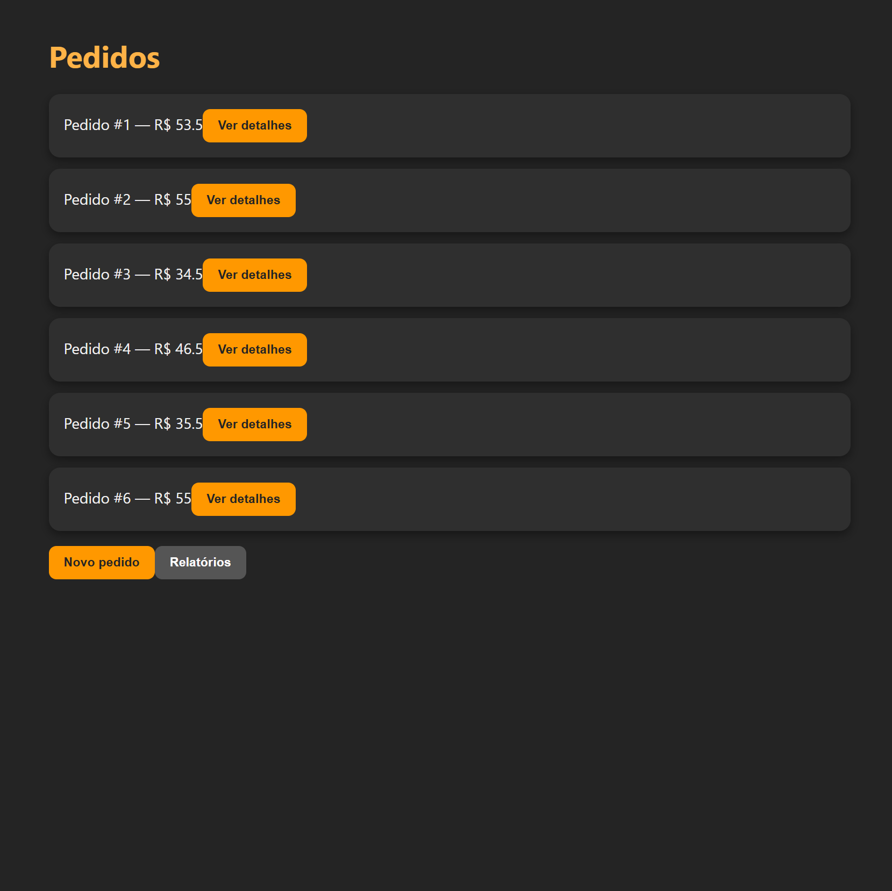
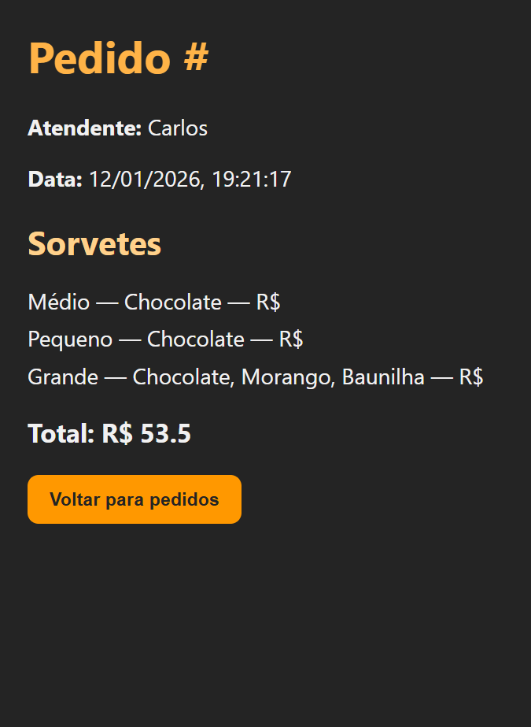

---

# 🍦 Sistema de Sorveteria — Frontend

🔒 **Acesso ao sistema**

Este sistema está publicado em ambiente de produção e faz parte de um projeto demonstrativo, desenvolvido para apresentar conceitos de frontend, integração com API e deploy em servidores cloud.

Frontend do sistema de sorveteria desenvolvido em **React**, consumindo uma **API REST em Spring Boot**, ambos publicados em **ambiente de produção**.

A interface foi construída com **React + Material UI (MUI)**, utilizando **componentes responsivos** e **tema escuro**, com foco em **usabilidade mobile-first**, organização visual e regras de negócio claras.

O sistema simula o fluxo real de uma sorveteria: **seleção de atendente**, **criação de pedidos**, **montagem de sorvetes**, **cálculo automático de valores** e **visualização de relatórios**.

---

## 📢 Stack / Tecnologias

`React` `JavaScript (ES6+)` `Vite`  
`Material UI (MUI)` `Responsive Design`  
`React Router DOM`  
`API REST` `Git` `GitHub`  
`Deploy com Vercel`

---

## 🧠 Competências Aplicadas

Neste projeto foram aplicados conhecimentos em:

- Criação de interfaces modernas com **React**
    
- Organização de projeto com **Vite**
    
- Navegação entre telas com **React Router DOM**
    
- **Consumo de API REST** (fetch + async/await)
    
- Gerenciamento de estado com **React Hooks**
    
- Componentização (pages / components)
    
- **Cálculo de regras de negócio no frontend**
    
- Integração completa com backend em **Spring Boot**
    
- UI responsiva com **Material UI**
    
- Layout **mobile-first**
    
- Boas práticas de organização e legibilidade de código
    
- Deploy do frontend em ambiente de produção (**Vercel**)
    

---

## 🎯 Objetivo do Frontend

Fornecer uma interface funcional e intuitiva para:

- Selecionar o atendente responsável pelo pedido
    
- Criar pedidos vinculados a um atendente
    
- Criar pedidos com **múltiplos sorvetes**
    
- Escolher **tamanho e sabores** para cada sorvete
    
- Calcular automaticamente valores parciais e total do pedido
    
- Adicionar múltiplos sorvetes antes de finalizar
    
- Remover sorvetes do pedido
    
- Finalizar pedidos
    
- Listar pedidos realizados
    
- Visualizar detalhes de cada pedido
    
- Exibir relatórios de vendas
    

---

## 🧭 Como Funciona o Sistema (Tutorial Rápido)

O sistema simula o funcionamento real de uma sorveteria, seguindo o fluxo abaixo:

1️⃣ **Seleção do atendente** responsável pelo atendimento.

2️⃣ **Criação do pedido**, onde o atendente monta o pedido do cliente.

3️⃣ Para cada sorvete:

- Seleção do **tamanho** (Pequeno, Médio ou Grande)
    
- Seleção de um ou mais **sabores**
    
- Cálculo automático do valor com base nas escolhas
    

4️⃣ Possibilidade de **adicionar múltiplos sorvetes** ao mesmo pedido.

5️⃣ **Finalização do pedido**, consolidando todos os itens e o valor total.

6️⃣ Tela de **listagem de pedidos**, permitindo:

- Visualizar pedidos realizados
    
- Acessar os detalhes de cada pedido
    

7️⃣ Tela de **relatórios**, exibindo:

- Total faturado
    
- Vendas por atendente
    
- Sabores mais vendidos
    
- Tamanhos mais vendidos
    

Este fluxo foi projetado para representar um cenário real de atendimento e controle de vendas.

---

## 📱 Responsividade (IMPORTANTE)

✔ Interface **totalmente responsiva**  
✔ Desenvolvida com foco em **mobile-first**  
✔ Funciona corretamente em:

- Celulares
    
- Tablets
    
- Desktop
    

Componentes se adaptam automaticamente ao tamanho da tela, garantindo boa experiência em qualquer dispositivo.

---

## 📂 Estrutura do Projeto

```
src
├─ api
│  └─ api.js                  # Comunicação com backend
├─ components
│  ├─ TamanhoItem.jsx         # Componente de seleção de tamanho
│  └─ SaborItem.jsx           # Componente de seleção de sabor
├─ pages
│  ├─ SelecionarAtendente.jsx # Tela inicial (seleção do atendente)
│  ├─ CriarPedido.jsx         # Criação e montagem do pedido
│  ├─ ListarPedidos.jsx       # Listagem de pedidos
│  ├─ PedidoDetalhe.jsx       # Detalhes do pedido
│  └─ Relatorios.jsx          # Relatórios de vendas
├─ App.jsx                    # Rotas
├─ main.jsx                   # Bootstrap do app
└─ index.css                  # Estilos globais
```

---

## 🖼️ Design e UI

- Tema escuro
    
- Paleta em tons de laranja (identidade visual)
    
- Componentes do **Material UI**
    
- Botões grandes e acessíveis
    
- Cartões claros e legíveis
    
- Interface pensada para uso rápido em ambiente real de atendimento
    

---

## 🌐 Sistema Online em Produção

Este frontend está **integrado a uma API REST online**, garantindo comunicação em tempo real entre interface e regras de negócio.

🔹 **Backend:** Spring Boot publicado em **servidor cloud (Railway)**  
🔹 **Frontend:** React publicado em **servidor cloud (Vercel)**

A integração permite:

- Comunicação contínua entre frontend e backend
    
- Consumo de endpoints REST em tempo real
    
- Envio e recebimento de dados em JSON
    
- Atualização imediata das informações na interface
    
- Funcionamento do sistema em ambiente de produção
    

Essa arquitetura demonstra um **sistema full stack online**, com frontend e backend executando em servidores distintos e integrados.

---

## ▶️ Como Executar o Projeto

1️⃣ Clone o repositório:

```bash
git clone https://github.com/Roggerrs/sorveteria-frontend
```

2️⃣ Instale as dependências:

```bash
npm install
```

3️⃣ Inicie o projeto:

```bash
npm run dev
```

4️⃣ Acesse no navegador:

```
http://localhost:5173
```

⚠ Certifique-se de que o backend esteja rodando antes.

---

## 🚀 Deploy

### 🌐 Frontend

O frontend foi publicado em **servidor cloud utilizando Vercel**, garantindo:

- Deploy automático a cada atualização do repositório
    
- Alta disponibilidade
    
- Otimização de build para aplicações React
    
- Entrega rápida de conteúdo (CDN)
    
- Ambiente ideal para demonstração e portfólio
    

### 🌐 Backend

O backend foi publicado em **servidor cloud (Railway)**, permitindo integração contínua com o frontend e execução da API em ambiente real.

---

## 📊 Telas Disponíveis

- **Selecionar Atendente**
    
- **Criar Pedido**
    
    - Seleção de tamanho
        
    - Seleção de sabores
        
    - Adição de múltiplos sorvetes
        
    - Cálculo automático do total
        
- **Listar Pedidos**
    
- **Detalhes do Pedido**
    
- **Relatórios**
    
    - Total faturado
        
    - Total por atendente
        
    - Sabores mais vendidos
        
    - Tamanhos mais vendidos
        

---

## 📸 Demonstração do Sistema

### Seleção de Atendente


### Criar Pedido


### Lista de Pedidos


### Relatórios


### Pedido


### Pedido detalhado



---


## 🧠 Contexto do Projeto

Este projeto foi desenvolvido com fins educacionais e práticos, simulando um sistema real de vendas.

O foco principal foi:

- Integração frontend + backend
    
- Regras de negócio no frontend
    
- Componentização
    
- UI responsiva
    
- Organização de código
    
- Fluxo real de atendimento e vendas
    

---

## 🔗 Projetos Relacionados

- Backend (Spring Boot):  
    [https://github.com/Roggerrs/sistema-sorveteria](https://github.com/Roggerrs/sistema-sorveteria)
    
- Modelagem SQL:  
    [https://github.com/Roggerrs/Sistema-Sorveteria-SQL](https://github.com/Roggerrs/Sistema-Sorveteria-SQL)
    

---

## ✅ Status do Projeto

✔ Funcional  
✔ Responsivo  
✔ Completo  
✔ Backend publicado (Railway)  
✔ Frontend publicado (Vercel)  
✔ API documentada com Swagger  
✔ Projeto de demonstração  
✔ Pronto para portfólio

---
